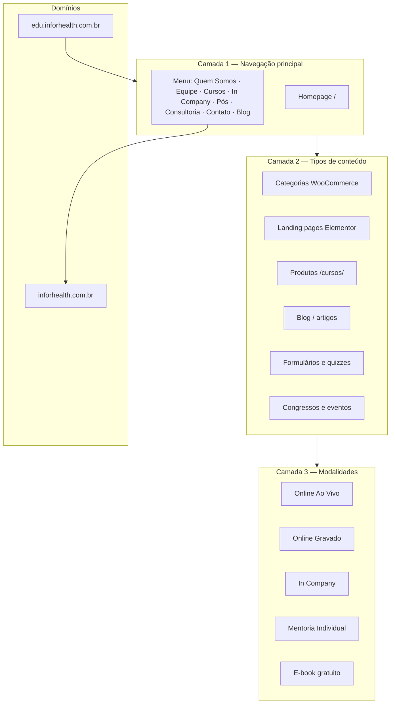

# Análise da Estrutura — Inforhealth Educação

> **Site analisado:** [https://edu.inforhealth.com.br/](https://edu.inforhealth.com.br/)  
> **Data da análise:** 07/06/2026  
> **Arquivos locais:** `Clientes/Inforhealth/` (251 arquivos, 5 pastas com conteúdo)

---

## 1. Resumo executivo

O portal **Inforhealth Educação** é uma plataforma de venda de treinamentos, consultorias e eventos para o nicho hospitalar e de saúde suplementar. O site atual é **híbrido**: mistura **dois builders diferentes** (WordPress/WooCommerce/Elementor + Website Builder da HostGator), o que explica a "bagunça" nos arquivos salvos localmente.

**Consegue navegar o sitemap completo?** Sim, parcialmente:
- `sitemap_index.xml` → funciona via acesso direto
- Sub-sitemaps disponíveis: `post-sitemap.xml`, `page-sitemap.xml`, `product-sitemap.xml`, `category-sitemap.xml`
- `sitemap.xml` retorna erro 500 (redireciona para index)
- **Total estimado de URLs indexadas: ~225 páginas**

**Subdomínios identificados:**
| Domínio | Função |
|---------|--------|
| `edu.inforhealth.com.br` | Portal de cursos (foco deste projeto) |
| `inforhealth.com.br` | Site institucional (menu aponta "Quem Somos" para `/sobre/` — página retorna 404 no momento) |

Não há outros subdomínios evidentes nos arquivos locais ou sitemaps.

---

## 2. Arquitetura do site (camadas)



### Camada 1 — Páginas institucionais

| Página | URL | Plataforma | Status local |
|--------|-----|------------|--------------|
| Homepage | `/` | Website Builder (HostGator) | Salva em `Cursos/` ⚠️ nome errado |
| Equipe | `/equipe/` | WordPress + Elementor | ✅ `equipe/` |
| Contato | `/contato/` | Website Builder | ✅ `contato/` |
| In Company | `/curso-in-company/` | WordPress | ❌ pasta vazia |
| Academia 360 | `/academia-corporativa-360/` | WordPress | ❌ não baixada |
| Quem Somos | `inforhealth.com.br/sobre/` | Site corporativo | ❌ externo, 404 |

### Camada 2 — Catálogo de cursos

**Duas estruturas paralelas** (legado + atual):

1. **Landing pages na raiz** (~159 páginas no `page-sitemap.xml`)
   - Ex.: `/curso-auditoria-contas-medicas/`, `/gestao-estrategica-do-corpo-clinico/`
   - Páginas de venda otimizadas (Elementor), com CTA, docente, programática

2. **Produtos WooCommerce em `/cursos/`** (28 URLs no `product-sitemap.xml`)
   - Ex.: `/cursos/auditoria-clinica/`, `/cursos/drg-do-conceito-a-aplicacao/`
   - Estrutura antiga de e-commerce, ainda indexada

3. **Categorias de filtro** (13 categorias):
   - `online_ao_vivo`, `online_gravado`, `in_company`
   - Temáticas: `qualidade`, `saude-suplementar`, `gestao-em-saude`, `faturamento`, `odontologia`, `medicina`, `congresso`, `seguranca-do-paciente`

### Camada 3 — Blog e conteúdo

| Tipo | Quantidade | URL base |
|------|------------|----------|
| Listagem do blog | 1 | `/blog_inforhealth-educacao-excelencia-saude/` |
| Artigos | 38 | URLs na raiz (ex.: `/lideranca-saude-estrategia-execucao-result/`) |

### Camada 4 — Eventos, congressos e materiais

Páginas promocionais de eventos pontuais:
- `/congresso-saude-suplementar-operadora2026/`
- `/congresso-administracao-hospitalar-2025/`
- `/3-congresso-saude-suplementar-2025-v2/`
- E-books e guias: `/guia-qualidade-na-saude-2025/`, `/domine-a-rn-623/`

---

## 3. Homepage — Cursos listados (ao vivo)

Conteúdo extraído do site ao vivo em jun/2026:

| # | Curso | Modalidade |
|---|-------|------------|
| 1 | Gestão de Rede Credenciada e Credenciamento em Saúde Suplementar | Ao Vivo |
| 2 | Auditoria Clínica | Ao Vivo |
| 3 | Formação de Auditores Internos de Qualidade (Manual ONA 2026) | Ao Vivo |
| 4 | Gestão Eficiente em Saúde | Ao Vivo |
| 5 | Governança 360° na Saúde Suplementar | Ao Vivo |
| 6 | Plano Terapêutico na Prática | Ao Vivo |
| 7 | Intensivo em Gestão Estratégica do Corpo Clínico | Ao Vivo |
| 8 | Gestão do Ciclo de Receitas Hospitalares | Ao Vivo |
| 9 | Mentoria Auditoria Interna e Gestão da Qualidade | Mentoria |
| 10 | Custos Assistenciais para Operadoras | Ao Vivo |
| 11 | DRG do Conceito à Aplicação | Ao Vivo |
| 12 | Gestão de Tecnologias e Infraestrutura em Saúde | Ao Vivo |
| 13 | Recursos de Glosas na Saúde Suplementar | Ao Vivo |
| 14 | Gestão de Indicadores em Saúde | Ao Vivo |
| 15 | Gestão de Pessoas em Saúde | Ao Vivo |
| 16 | Governança Regulatório-Estratégica (ANS 2026–2028) | Ao Vivo |
| 17 | Auditoria de Contas Médicas | Ao Vivo |
| 18 | Regulamentação de Planos de Saúde e ANS | Ao Vivo |
| 19 | Gestão de Contratos e Negociação | Ao Vivo |
| 20 | Governança Clínica | Ao Vivo |
| 21 | Mentoria de Auditor Interno de Qualidade | Mentoria |
| 22 | Marketing em Saúde | Ao Vivo |
| 23 | Workshop Telemedicina | Ao Vivo |
| 24 | Planejamento e Gestão Estratégica em Saúde | Ao Vivo |
| 25 | Governança, Compliance e Acreditação em Operadoras | Ao Vivo |
| 26 | Formação em Gestão de Contratos e Negociação | Ao Vivo |
| 27 | Gestão de Suprimentos Hospitalares | Ao Vivo |
| 28 | Gestão de Faturamento em Saúde | Ao Vivo |
| 29 | Gestão Orçamentária e Financeira em Saúde | Ao Vivo |
| 30 | Gestão de Projetos e Metodologias Ágeis | Ao Vivo |

**Online Gravado** (home):
- Segurança do Paciente (10h)
- Gestão da Assistência Odontológica (10h)
- Ferramentas de Gestão da Qualidade (12h)
- SCIH e Segurança do Paciente (8h)
- Implantação e Gestão da Jornada do Paciente (1h)
- Liderança para Profissionais de Saúde (2h)

**Números institucionais (home):**
- 190+ empresas atendidas
- 6.000+ profissionais capacitados
- 95% satisfação dos clientes

**Contato:**
- E-mail: contato@inforhealth.com.br
- WhatsApp: +55 19 99777-3084

---

## 4. Equipe docente (extraída de `/equipe/`)

| Nome | Arquivo de imagem local |
|------|-------------------------|
| Dr. Luis Ozan (fundador/líder) | `prof_luis_c21402c64016.jpg` |
| Profa. Ma. Eliane Santana | `PROFA_971706f17c56.png` |
| Profa. Ana Cristina dos Santos | `PROFA_9f7a9eeb41c8.png` |
| Profa. Ma. Patricia Mitsue Shimabukuro | `PROFA_3aeb8bae087b.png` |
| Profa. Kehone Miranda | `equipe-inforhealth-Kehone_2f7ac266d43e.png` |
| Profa. Sheila Canos | `PROFA_4ef93d95a20b.png` |
| Prof. Dr. Márcio Mielo | `PROF_0a24eb6e4631.png` |
| Profa. Dra. Maria Luiza Monteiro Costa | `PROFA_e596a6f537e0.png` |
| Prof. Me. Marcelo Gorri Mazzali | `PROF_a9a6f62bfd2b.png` |
| Profa. Paula Nahas | `PROFA_514c1240fd81.png` |
| Prof. Ailton Pedro Batista | `PROF_32041a1b410b.png` |
| Profa. Dra. Hellen Maria de Lima Graf Fernandes | `PROFA_f3eb2a3181f8.png` |
| Prof. José Antonio Lopes Macedo | `equipe-inforhealth-Jose-Antoni_c2bbb729a4e5.png` |

> Outros docentes aparecem nas landing pages de cursos (Renata Apolinário, Luan Henrique, Dra. Débora Macedo, Karen, Jefferson, Ricardo Mendes, Achernar Sena, etc.) — imagens ainda não organizadas localmente.

---

## 5. Diagnóstico dos arquivos locais (a "bagunça")

### Problemas identificados

| Problema | Detalhe |
|----------|---------|
| **Nomenclatura confusa** | Pasta `Cursos/` contém a **homepage** (`title: "Início"`), não listagem de cursos |
| **Pasta vazia** | `curso-in-company/` existe mas não tem arquivos |
| **Duas plataformas** | `equipe/` e `blog/` = WordPress; `Cursos/` e `contato/` = Website Builder |
| **Assets duplicados** | Cada pasta tem ~30–107 imagens + dezenas de JS/CSS idênticos entre pastas |
| **HTML monolítico** | Arquivos de 200KB–500KB, difícil extrair conteúdo manualmente |
| **Cobertura parcial** | Apenas 4 de ~225 páginas salvas localmente (~1,7%) |
| **Imagens genéricas** | Homepage usa Unsplash e CDN HostGator, não fotos reais |
| **Links quebrados** | "Quem Somos" aponta para domínio externo com 404 |

### Inventário local

```
Clientes/Inforhealth/
├── Cursos/              → Homepage (Website Builder) — MAL NOMEADA
├── contato/             → Página de contato (Website Builder)
├── equipe/              → Equipe docente (WordPress/Elementor) ✅
├── blog_.../            → Listagem do blog (WordPress)
└── curso-in-company/    → VAZIA
```

---

## 6. Plano de organização (próximas atividades)

### Fase A — Organizar imagens
- [ ] Copiar fotos da equipe de `equipe/assets/` → `imagens/equipe/`
- [ ] Renomear com padrão: `nome-sobrenome.png`
- [ ] Baixar imagens de docentes das landing pages (via sitemap)
- [ ] Separar: institucional / cursos / equipe / parceiros / eventos

### Fase B — Organizar conteúdo em .md
- [ ] `01-sobre-empresa.md` — missão, números, proposta de valor
- [ ] `02-equipe.md` — perfis completos dos 13+ docentes
- [ ] `03-modalidades.md` — ao vivo, gravado, in company, mentoria
- [ ] `cursos/` — um arquivo por curso (ex.: `curso-auditoria-clinica.md`)
- [ ] `04-parceiros-e-clientes.md` — logos, cases (se existirem)
- [ ] `05-contato.md` — e-mail, WhatsApp, formulários
- [ ] `06-blog-indice.md` — lista dos 38 artigos (conteúdo opcional)

### Fase C — Discussão da nova estrutura
- [ ] Definir arquitetura de informação unificada
- [ ] Escolher stack do novo portal
- [ ] Criar `REFERENCIA-PORTAL.md` com wireframe e mapa de páginas

---

## 7. Proposta preliminar de estrutura para o novo portal

```
/                          → Home (hero + cursos em destaque + números + CTA)
/cursos                    → Catálogo com filtros (modalidade, tema)
/cursos/[slug]             → Página individual do curso
/in-company                → Corporativo B2B
/equipe                    → Docentes e consultores
/sobre                     → Empresa (unificar com institucional)
/contato                   → Formulário + WhatsApp
/blog                      → Artigos
/eventos                   → Congressos (opcional, separar do catálogo)
/academia-360              → Produto corporativo
```

**Princípios sugeridos:**
1. Uma URL por curso (eliminar duplicidade `/cursos/` vs landing na raiz)
2. Conteúdo em Markdown como fonte única de verdade
3. Imagens nomeadas e catalogadas antes do desenvolvimento
4. Separar eventos pontuais (congressos) do catálogo permanente

---

## 8. Limitações da navegação automática

| Recurso | Status |
|---------|--------|
| Sitemap index | ✅ Acessível |
| Páginas individuais | ✅ Acessíveis (fetch/curl) |
| Imagens wp-content | ✅ URLs públicas no sitemap |
| Site corporativo | ⚠️ `/sobre/` retorna 404 |
| Área logada / checkout | ❌ Não acessível sem credenciais |
| Subdomínios além de edu | ❌ Não encontrados no sitemap |

---

*Documento gerado na Fase 1 — Análise. Próximo passo: executar Fase A e B de organização.*
