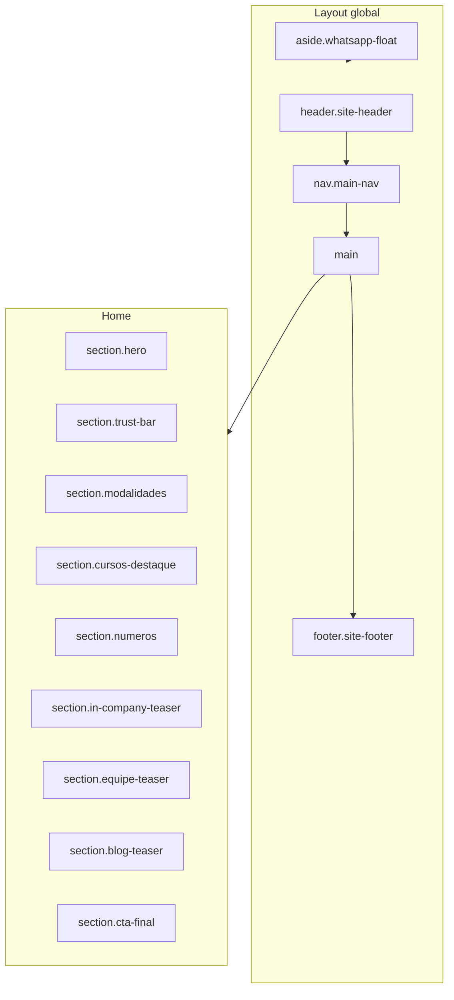

# Referência — Portal Novo Inforhealth

> **Passo 3:** Arquitetura, referências externas e esqueleto HTML  
> **Data:** 07/06/2026  
> **Esqueleto:** pasta `site/`

---

## 1. Princípios do rebuild (resposta à anamnese)

| Problema atual | Solução no novo portal |
|----------------|------------------------|
| 2 builders + WooCommerce legado | **HTML/CSS/JS único** (ou CMS leve) alimentado pelos `.md` em `content/` |
| URLs duplicadas | **1 slug por curso:** `/cursos/[slug]/` |
| Home com lista infinita | **Home enxuta** + catálogo filtrável em `/cursos/` |
| Quem Somos em domínio externo (404) | **`/sobre/`** no mesmo domínio |
| Eventos misturados | **`/eventos/`** separado do catálogo permanente |
| Menu com 8+ itens | **5 itens principais** + CTA WhatsApp fixo |
| FAQ repetido em cada LP | **Componente `<faq>`** reutilizável |
| Conteúdo fragmentado | **`content/`** como fonte única de verdade |

---

## 2. Três referências da internet

### Referência 1 — [Integrity CE](https://www.integrityce.com/)

**Por que usar:** Portal de educação continuada em saúde (CME/CE), o mais próximo do nicho da Inforhealth.

| O que copiar | Onde aplicar |
|--------------|--------------|
| Home com **cursos populares** + **próximos eventos** | `index.html` — destaques + agenda |
| Catálogo `/online-courses` com **filtros** (tipo, certificado, duração) | `cursos.html` |
| Página de curso com foco em **credito/certificação** | `curso.html` |
| Separação clara **cursos gravados** vs **eventos ao vivo** | Modalidades Inforhealth |
| Tom institucional + prova de acreditação (ACCME) | Seção trust bar (ONA, certificado, FHO) |

**Case técnico:** [Ayatas — Integrity CE rebuild](https://www.ayatas.com/our-works/integrityce/) documenta migração de site legado para LMS + catálogo unificado — paralelo direto com este projeto.

---

### Referência 2 — [FGV Educação Executiva](https://educacao-executiva.fgv.br/)

**Por que usar:** Referência brasileira de excelência em educação executiva, com B2B e múltiplas modalidades — similar ao posicionamento premium da Inforhealth.

| O que copiar | Onde aplicar |
|--------------|--------------|
| Hub **“Cursos por Modalidade”** (presencial, EAD, ao vivo) | Filtros: Ao Vivo · Gravado · In Company · Mentoria |
| Hub **“Cursos por Área”** | Filtros temáticos: Qualidade, Suplementar, Faturamento… |
| Bloco **FGV In Company** dedicado | `in-company.html` |
| Números de autoridade + unidades/parceiros | Barra 190+ empresas · 6.000+ profissionais |
| Navegação limpa com busca no header | Header do esqueleto |

**Portal institucional complementar:** [portal.fgv.br/programas-de-ensino](https://portal.fgv.br/programas-de-ensino) — modelo de **página hub** que agrupa tipos de programa sem listar tudo na home.

---

### Referência 3 — [LearnWorlds — Solução Saúde](https://www.learnworlds.com/solutions/health/)

**Por que usar:** Não é um portal de cliente, mas referência de **estrutura ideal** para plataformas de treinamento em saúde (layout, jornada, trust signals).

| O que copiar | Onde aplicar |
|--------------|--------------|
| Hero com proposta clara + CTA duplo (“Ver cursos” / “Falar com especialista”) | Hero da home |
| Seções modulares repetíveis (benefícios, formatos, depoimentos) | Componentes reutilizáveis |
| Destaque para **certificação, compliance e mobile** | Trust bar + FAQ |
| Templates de **landing page por curso** consistentes | `curso.html` |
| Separação **B2C (cursos abertos)** vs **B2B (corporativo)** | Home → In Company / Academia 360 |

---

## 3. Mapa de páginas (sitemap novo)

```
/                           → Home (hero, destaques, números, modalidades, CTA)
/cursos/                    → Catálogo com filtros + busca
/cursos/[slug]/             → Detalhe do curso (1 template)
/sobre/                     → Empresa (missão, história, números)
/equipe/                    → Grid de docentes
/in-company/                → B2B corporativo + formulário proposta
/academia-360/              → Produto corporativo LMS
/eventos/                   → Congressos e workshops (ativos)
/blog/                      → Listagem de artigos
/blog/[slug]/               → Artigo
/contato/                   → Formulário + WhatsApp + e-mail
/e-book/                    → Lead magnet (Saúde Suplementar)
```

**Redirects 301** (migração): mapear ~159 LPs antigas → `/cursos/[slug]/`

---

## 4. Arquitetura HTML — visão geral



---

## 5. Componentes reutilizáveis

| Componente | Uso |
|------------|-----|
| `<header>` + nav | Todas as páginas |
| `.course-card` | Home, catálogo, relacionados |
| `.instructor-card` | Equipe, detalhe do curso |
| `.trust-bar` | Números + selos (certificado, ONA) |
| `.modalidade-tabs` | Filtro Ao Vivo / Gravado / In Company |
| `.faq-accordion` | Detalhe curso (conteúdo único em JSON/md) |
| `.cta-banner` | WhatsApp + “Ver turmas abertas” |
| `.footer` | Links, contato, redes |

---

## 6. Wireframe — Home (blocos)

```
┌─────────────────────────────────────────────────────────┐
│ LOGO          Cursos  In Company  Equipe  Sobre  [CTA]  │
├─────────────────────────────────────────────────────────┤
│  HERO                                                    │
│  "Capacitação de Excelência para Profissionais da Saúde"│
│  [Ver Cursos]  [WhatsApp]                               │
├─────────────────────────────────────────────────────────┤
│  190+ empresas │ 6.000+ profissionais │ 95% satisfação  │
├─────────────────────────────────────────────────────────┤
│  MODALIDADES (4 cards)                                   │
│  [Ao Vivo] [Gravado] [In Company] [Mentoria]            │
├─────────────────────────────────────────────────────────┤
│  CURSOS EM DESTAQUE (grid 3x2)          [Ver todos →]    │
├─────────────────────────────────────────────────────────┤
│  IN COMPANY + ACADEMIA 360 (2 colunas)                  │
├─────────────────────────────────────────────────────────┤
│  EQUIPE (3 docentes)                    [Ver equipe →]   │
├─────────────────────────────────────────────────────────┤
│  BLOG (3 posts)                         [Ver blog →]    │
├─────────────────────────────────────────────────────────┤
│  CTA FINAL — "Ficou com dúvida?" WhatsApp               │
├─────────────────────────────────────────────────────────┤
│  FOOTER — links · contato · copyright                   │
└─────────────────────────────────────────────────────────┘
                              [WhatsApp flutuante]
```

---

## 7. Wireframe — Catálogo `/cursos/`

```
┌─────────────────────────────────────────────────────────┐
│ HEADER                                                   │
├──────────┬──────────────────────────────────────────────┤
│ FILTROS  │  BUSCA [________________________] [Buscar]   │
│          │                                               │
│ Modalid. │  ┌─────┐ ┌─────┐ ┌─────┐                    │
│ □ Ao vivo│  │ cur │ │ cur │ │ cur │  ...               │
│ □ Gravado│  └─────┘ └─────┘ └─────┘                    │
│ □ In Co. │  ┌─────┐ ┌─────┐ ┌─────┐                    │
│          │  │ cur │ │ cur │ │ cur │                    │
│ Tema     │  └─────┘ └─────┘ └─────┘                    │
│ □ Qualid.│                                               │
│ □ Gestão │  [Carregar mais]                              │
│ □ ANS    │                                               │
└──────────┴──────────────────────────────────────────────┘
```

---

## 8. Wireframe — Detalhe do curso `/cursos/[slug]/`

```
┌─────────────────────────────────────────────────────────┐
│ Breadcrumb: Início > Cursos > [Nome do curso]           │
├──────────────────────────────┬──────────────────────────┤
│ Título + badge modalidade    │  CARD INSCRIÇÃO          │
│ Resumo                       │  Carga horária           │
│                              │  Certificado ✓           │
│ [Imagem docente]             │  [Inscrever-se]          │
│                              │  [WhatsApp]              │
├──────────────────────────────┴──────────────────────────┤
│ O que você vai aprender (lista)                         │
├─────────────────────────────────────────────────────────┤
│ Programação / Conteúdo (accordion)                      │
├─────────────────────────────────────────────────────────┤
│ Sobre o docente (.instructor-card)                      │
├─────────────────────────────────────────────────────────┤
│ FAQ (accordion reutilizável)                            │
├─────────────────────────────────────────────────────────┤
│ Cursos relacionados (3 cards)                           │
└─────────────────────────────────────────────────────────┘
```

---

## 9. Esqueleto HTML entregue

Arquivos na pasta `site/`:

| Arquivo | Função |
|---------|--------|
| `index.html` | Home completa (wireframe semântico) |
| `cursos.html` | Catálogo com sidebar de filtros |
| `curso.html` | Template de detalhe (ex.: Auditoria Clínica) |
| `equipe.html` | Grid de docentes |
| `sobre.html` | Institucional |
| `in-company.html` | B2B |
| `contato.html` | Contato |
| `css/wireframe.css` | Estilo wireframe (caixas, grid, placeholders) |

**Convenções do esqueleto:**
- HTML5 semântico (`header`, `nav`, `main`, `section`, `article`, `aside`, `footer`)
- Classes BEM-like (`.course-card`, `.site-header`)
- Comentários `<!-- COMPONENT: ... -->` para guiar o design depois
- Links entre páginas funcionais (navegação local)
- Conteúdo real vindo dos `.md` já organizados (amostras)
- **Sem** WordPress, Elementor ou builders — HTML puro como base

---

## 10. Stack sugerida (próxima fase)

| Camada | Sugestão | Motivo |
|--------|----------|--------|
| Marcação | HTML estático → Astro/11ty depois | Gera páginas a partir dos `.md` |
| Estilo | CSS custom ou Tailwind | Controle total vs. site atual |
| Conteúdo | Markdown em `content/` | Já organizado |
| Hospedagem | Netlify / Vercel / HostGator estático | Performance, sem WP pesado |
| Checkout | Link externo (Kiwify) ou embed | Mantém fluxo atual |

---

## 11. Checklist passo 3

- [x] Referências externas (3)
- [x] Mapa de páginas novo
- [x] Wireframes textuais
- [x] Esqueleto HTML navegável
- [ ] Design visual (identidade, cores, tipografia)
- [ ] Implementação CSS final
- [ ] Geração automática MD → HTML
- [ ] Plano de redirects 301

---

*Próximo passo sugerido: abrir `site/index.html` no browser e validar a navegação entre páginas antes de aplicar o design.*
